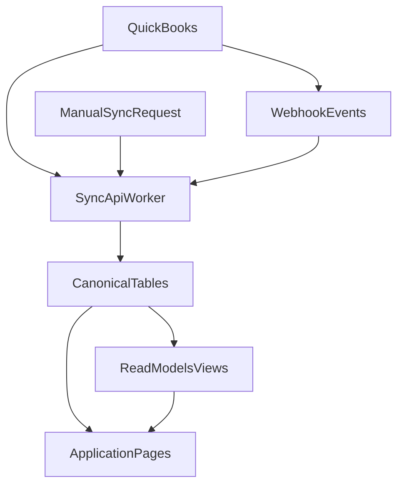

# BSE.Manager Backend-First Product Specification (v2)

This document defines the target backend-first architecture for BSE.Manager, based on the current codebase and the approved planning decisions:

- one-way sync from QuickBooks to Supabase first
- unified project expense model
- non-retroactive effective-dated rate behavior

## 1) Product Data Principles

1. Supabase is the operational system of record for application reads, derived metrics, and user workflows.
2. QuickBooks is the accounting-origin source for synced entities (customers/projects, invoices, time, expenses, transactions).
3. Every computed KPI (especially multiplier) must come from one canonical definition and one backend computation contract.
4. Historical billing logic is immutable by default:
   - previously priced/billed entries stay priced
   - new entries use the active rate as of entry date
5. Reimbursables are modeled as pass-through expenses with explicit flags and status transitions.

## 2) Canonical Data Model

## 2.1 Keep and Reuse Existing Core Tables

Current tables remain core:

- `profiles`, `clients`, `projects`
- `proposals`, `proposal_phases`, `contract_phases`
- `invoices`, `invoice_line_items`
- `time_entries`
- `billable_rates` (as transitional source)
- `reimbursables`, `contract_labor` (to be migrated into unified expense model)
- `cash_flow_entries`, `qbo_income`

## 2.2 New Canonical Tables

### A) `project_expenses` (new canonical expense ledger)

Purpose: unify contract labor + other project expenses + reimbursable workflow in one table.

Key columns:

- `id` bigint pk
- `source_system` text (`qbo`, `manual`, `import`)
- `source_entity_type` text (`purchase`, `bill`, `expense`, `journal`, etc.)
- `source_entity_id` text nullable (idempotent external key)
- `source_line_id` text nullable
- `project_id` bigint nullable fk `projects.id`
- `project_number` text nullable (denormalized for resilience/search)
- `vendor_name` text nullable
- `expense_date` date not null
- `description` text nullable
- `category_name` text nullable (QBO account/category)
- `sub_category_name` text nullable
- `fee_amount` numeric(14,2) not null default 0
- `is_reimbursable` boolean not null default false
- `markup_pct` numeric(7,4) not null default 0.15
- `amount_to_charge` numeric(14,2) generated or maintained column
- `status` text (`pending`, `ready_to_invoice`, `invoiced`, `ignored`) default `pending`
- `invoice_id` bigint nullable fk `invoices.id`
- `invoice_number` text nullable
- `date_invoiced` date nullable
- `qbo_last_updated_at` timestamptz nullable
- `last_synced_at` timestamptz nullable
- `created_at` timestamptz default now()
- `updated_at` timestamptz default now()

Indexes:

- unique `(source_system, source_entity_type, source_entity_id, source_line_id)` where external keys exist
- btree on `(project_number, expense_date)`
- btree on `(status, is_reimbursable)`
- btree on `(invoice_id)`

### B) `employee_title_history` (effective-dated title timeline)

Purpose: record title/position history per employee for billing-rate resolution.

Columns:

- `id` bigint pk
- `employee_id` text not null
- `employee_name` text not null
- `title` text not null
- `effective_from` date not null
- `effective_to` date nullable
- `is_current` boolean default false
- `created_at`, `updated_at`

Constraints:

- no overlapping ranges per `employee_id`
- exactly one `is_current = true` row per employee (trigger-enforced)

### C) `proposal_rate_cards` (proposal-scoped rate schedule)

Purpose: store billable rates by title/position for each proposal (and inherited project).

Columns:

- `id` bigint pk
- `proposal_id` bigint not null fk `proposals.id`
- `project_id` bigint nullable fk `projects.id`
- `position_title` text not null
- `hourly_rate` numeric(12,2) not null
- `effective_from` date not null
- `effective_to` date nullable
- `created_at`, `updated_at`

Indexes:

- `(proposal_id, position_title, effective_from desc)`
- `(project_id, position_title, effective_from desc)`

### D) `time_entry_bill_rates` (immutable rating snapshot)

Purpose: persist the exact billing-rate resolution per time entry.

Columns:

- `time_entry_id` bigint pk fk `time_entries.id`
- `employee_id` text nullable
- `employee_name` text not null
- `resolved_title` text not null
- `resolved_hourly_rate` numeric(12,2) not null
- `rate_source` text (`proposal_rate_cards`, `override`, `fallback`)
- `rate_source_id` bigint nullable
- `effective_from_used` date nullable
- `resolved_at` timestamptz not null

Rule:

- created/updated at sync/import time for new entries only unless explicit re-rate action is requested.

### E) `sync_runs` and `sync_watermarks` (observability + replay)

`sync_runs`:

- `id` bigint pk
- `domain` text (`customers`, `projects`, `invoices`, `time_entries`, `project_expenses`, `transactions`)
- `trigger_mode` text (`manual`, `webhook`, `scheduled`)
- `started_at`, `finished_at`
- `status` text (`success`, `partial_success`, `failed`)
- `imported_count`, `updated_count`, `deleted_count`, `skipped_count`, `error_count`
- `request_payload` jsonb nullable
- `error_summary` jsonb nullable

`sync_watermarks`:

- `domain` text pk
- `last_successful_qbo_updated_at` timestamptz nullable
- `last_successful_cursor` text nullable
- `updated_at` timestamptz

## 2.3 Table Organization Strategy

- Canonical transactional tables:
  - `invoices`, `invoice_line_items`, `time_entries`, `project_expenses`
- Reference/config tables:
  - `profiles`, `clients`, `projects`, `proposals`, `proposal_rate_cards`, `employee_title_history`
- Operational metadata:
  - `sync_runs`, `sync_watermarks`
- Read models/views:
  - dashboard, multiplier, AR, P&L, cash flow materialized views

This separation keeps writes deterministic and reads performant.

## 3) Canonical Financial Definitions

## 3.1 Revenue Metrics

- `revenue_gross`:
  sum of all issued invoice amounts for project (`invoices.amount`)
- `revenue_reimbursable`:
  sum of reimbursable invoice line amounts
- `revenue_net_services`:
  `revenue_gross - revenue_reimbursable`

## 3.2 Cost Metrics

- `cost_bse_labor`:
  sum `time_entries.labor_cost`
- `cost_other_project_expenses`:
  sum non-reimbursable rows from `project_expenses`
- `cost_total_project`:
  `cost_bse_labor + cost_other_project_expenses`

## 3.3 Multiplier (Canonical)

- `project_multiplier = revenue_net_services / cost_total_project`
- Return `null` when numerator <= 0 or denominator <= 0.
- Use this exact definition on:
  - projects list
  - project detail card
  - dashboard active-project table
  - any API/export

## 4) Rate Resolution Contract (Approved Behavior)

Non-retroactive effective-date logic:

1. Identify time entry date + employee.
2. Resolve employee title active on entry date from `employee_title_history`.
3. Resolve rate from `proposal_rate_cards` by project/proposal + title + entry date.
4. Persist snapshot in `time_entry_bill_rates`.
5. Do not automatically reprice historical entries when title/rates change later.

## 5) One-Way QBO Sync Architecture (Phase 1)

## 5.1 Domain Pipelines

- `customers/projects`: QBO Customer + sub-customer/job -> `clients`, `projects`
- `invoices`: QBO Invoice header -> `invoices`
- `invoice lines`: QBO Invoice lines -> `invoice_line_items` (full replacement per invoice)
- `time entries`: QBO TimeActivity -> `time_entries` + `time_entry_bill_rates`
- `project expenses`: QBO Purchase/Bill/project expense lines -> `project_expenses`
- `transactions/categories`: QBO transaction stream -> reporting tables/views for P&L and cash flow

## 5.2 Idempotency Keys

- invoices: `qb_invoice_id`
- invoice lines: `(invoice_id, qb_line_id)` where available, otherwise deterministic hash
- time entries: `qb_time_id`
- project expenses: `(source_system, source_entity_type, source_entity_id, source_line_id)`

## 5.3 Deletion/Reconciliation Rules

- Maintain seen-key set per full sync domain.
- For one-way domains:
  - if key no longer present in QBO after full scan, soft-delete or hard-delete by policy.
- For invoice lines:
  - replace-all for invoice id to guarantee exact source parity.

## 5.4 Webhooks + Manual Sync

- Webhook endpoint triggers selective domain sync (`invoice`, `purchase`, `bill`, `timeactivity`).
- Manual sync remains available on Settings page for all domains.
- Both flows write `sync_runs` and advance `sync_watermarks` only on success.

## 5.5 Sync Reliability

- Paginated fetches for all large domains.
- Domain-level retries with bounded backoff.
- `partial_success` status when some rows fail.
- Persist sample errors in `sync_runs.error_summary`.

## 6) Page-by-Page Functional and Data Contracts

## 6.1 Dashboard

Admin dashboard:

- Dynamic invoiced-by-month chart
  - dataset: invoice totals grouped by month
  - control: month-window selector
- Accounts receivable
  - dataset: unpaid invoice totals + aging
- Active projects with multipliers
  - dataset: canonical multiplier view
- Dynamic labor-cost pie chart
  - control: selected project + breakdown mode (`employee`/`phase`)

PM dashboard:

- same components but filtered to projects where `projects.pm_id = current_user.id`

## 6.2 Projects List

- Keep current table layout and grouped year UX.
- Multiplier cell must consume canonical API/view only.
- Filters: project #, client, municipality/county, PM, archive state.
- Row actions: open detail, archive toggle, edit phases.

Data source contract:

- Base: `projects` + `clients` + PM display map
- Metric: `/api/projects/multipliers` -> canonical formula implementation

## 6.3 Project Detail

Tabs:

- Dashboard
  - revenue/cost/multiplier cards using canonical definitions
  - phase progress + employee distribution
- Contract Phases
  - phase budget, billed values, labor by phase, phase multiplier
- Invoices
  - invoice header + line breakdown
- Labor
  - time entries + filters + totals
- Contract Labor/Expenses
  - read from unified `project_expenses` filtered by category/flags
- Reimbursables
  - filtered subset where `is_reimbursable = true`

## 6.4 Invoices Page

- Table-first listing of imported QBO invoices
- Expand row for `invoice_line_items`
- Filters: date range, project, status
- Total row for filtered result set

Data source:

- `invoices` + `invoice_line_items` only (no mixed local calculation)

## 6.5 Unbilled Report Page

Goal: month-end invoice prep report for approved previous-month labor.

Required fields per entry:

- project, phase, employee, entry date, hours, notes
- resolved title
- resolved bill rate
- amount to bill (`hours * resolved_bill_rate`)

Summary layers:

- by project+phase
- by employee within phase
- grand total

Data source:

- `time_entries` + `time_entry_bill_rates` + proposal/project metadata

## 6.6 Time Entries Page

- Keep current UX
- Ensure complete pagination on read
- Display operational QA fields (billable, billed, project link integrity)

## 6.7 Reimbursables Page (becomes Project Expenses workflow)

Primary table columns:

- expense date
- project
- description
- fee amount
- reimbursable checkbox
- amount to charge (auto = fee * 1.15 when reimbursable true)
- status (`pending`/`invoiced`)
- invoice number

Workflow:

1. expense synced from QBO
2. user toggles reimbursable flag
3. status transitions to `ready_to_invoice`
4. once invoiced, system stores invoice link and status `invoiced`

## 6.8 Proposals Page

- Keep current proposal UX.
- Add/manage proposal rate cards:
  - position/title
  - hourly rate
  - effective date range
- On project execution, proposal rate card becomes the default billing-rate basis.

## 6.9 Profit and Loss Page

- Mimic QBO P&L layout by category/subcategory.
- Dynamic period selector.
- Data source:
  - synced transactions + category mapping table/view.

## 6.10 Cash Flow Page

- Spreadsheet-style monthly budget/projection view.
- Income rows + expense rows by QBO categories.
- Monthly columns with actual/projected values.
- Net cash flow row = total income - total expenses per month.

## 6.11 Settings Page

- User management remains.
- Sync controls remain but should include:
  - domain-level last run status
  - run counts
  - sync run logs (latest errors)

## 7) Storage and Organization Rules

- All monetary values as `numeric(12,2)` or higher precision where needed.
- All external IDs stored as text.
- Keep denormalized `project_number` in transactional tables for resilience and search.
- Use soft-delete columns (`deleted_at`) where business recovery/audit is required.
- Use explicit audit columns:
  - `created_at`, `updated_at`, `last_synced_at`, `qbo_last_updated_at`

## 8) Security and RLS Requirements

- Admin-only write for sync and system configuration tables.
- PM scoped reads to assigned projects for operational pages.
- Employee scoped reads for relevant labor/time pages as needed.
- Service role only for backend sync routes.

## 9) Implementation Roadmap

## Phase 1: Schema + Formula Contract

- create new tables: `project_expenses`, `employee_title_history`, `proposal_rate_cards`, `time_entry_bill_rates`, `sync_runs`, `sync_watermarks`
- define multiplier SQL/view/API contract
- document data dictionary and status enums

## Phase 2: Sync Refactor

- split domain sync modules from monolithic route
- implement idempotent upsert/reconciliation for each domain
- add run logging and watermarks

## Phase 3: Read Model Alignment

- move dashboard/projects/unbilled to canonical read models
- eliminate duplicate formula logic in page components

## Phase 4: Unified Expense UX

- migrate `contract_labor` + reimbursable workflow to `project_expenses`
- update reimbursables page and project detail tabs

## Phase 5: Financial Reporting

- implement P&L and cash-flow data models/views + UI
- add period controls and projection support

## Phase 6: Hardening

- RLS policy review
- sync alerting/monitoring
- QA reconciliation scripts (invoice parity, expense parity, rate coverage)

## 10) Migration Notes from Current State

1. Keep existing tables operational during migration.
2. Backfill `project_expenses` from:
   - `contract_labor`
   - reimbursable rows currently in `reimbursables`
3. Introduce compatibility views so current pages keep working during transition.
4. Move pages incrementally to new read models; do not big-bang cutover.

