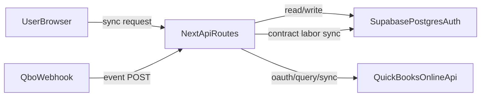
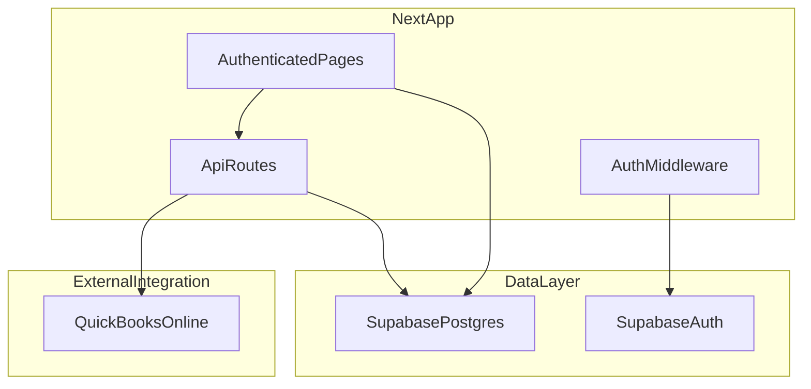
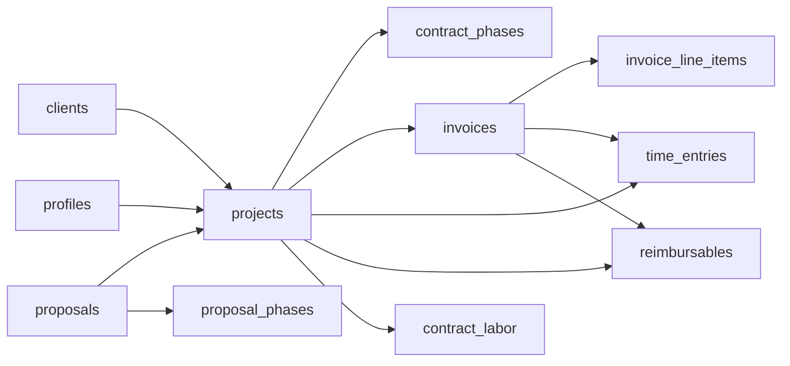

# BSE Manager Master Blueprint

## 1) Executive Summary

BSE Manager is a role-based internal operations platform for engineering project delivery and billing. It centralizes project setup, contract phases, labor, contract labor, reimbursables, invoices, and QuickBooks synchronization in a single web application.

Primary business outcomes:
- Keep project financials and billing readiness visible in real time.
- Synchronize operational and accounting data with QuickBooks Online (QBO).
- Support PM/admin workflows across project lifecycle, labor/cost tracking, and invoicing.
- Provide a stable foundation for systematic delivery with controlled technical debt.

Scope in this document is current-state code only.

---

## 2) Product Definition (Current-State PRD)

## 2.1 What the Application Is

Web application built on Next.js App Router + Supabase + React Query for managing:
- Projects and contract phases
- Time and labor costs
- Contract labor expenses
- Reimbursables
- Invoices and invoice line-item detail
- QuickBooks sync and webhook-driven updates

Core references:
- `src/app/(authenticated)/dashboard/page.tsx`
- `src/app/(authenticated)/projects/page.tsx`
- `src/app/(authenticated)/projects/[id]/page.tsx`
- `src/app/(authenticated)/invoices/page.tsx`
- `src/app/api/qb-time/sync/route.ts`

## 2.2 What the Application Does

- Authenticates users via Supabase auth/session cookies.
- Provides role-filtered navigation and protected authenticated routes.
- Displays operational dashboards for backlog, AR, and billing candidates.
- Maintains project details and phase definitions.
- Tracks labor from time entries and contract labor expenses.
- Tracks reimbursable fees/charges and invoice associations.
- Syncs customers, projects, invoices, time entries, and contract labor from QBO.

## 2.3 Users and Permissions

Role model (`user_role` enum):
- `admin`
- `project_manager`
- `employee`
- `client`

Role-filtered sidebar behavior:
- `admin`: full access including settings, rates, clients, cash flow, contract labor.
- `project_manager`: broad operational access without full admin-only sections.
- `employee`: limited operational navigation.
- `client`: restricted (sidebar suppresses internal role-gated pages).

References:
- `src/components/layout/sidebar.tsx`
- `src/lib/types/database.ts`

---

## 3) Workflow Catalog

## 3.1 Authentication and Session

1. User accesses protected route.
2. Middleware validates Supabase session.
3. Unauthenticated users are redirected to `/login`.
4. Authenticated users are redirected from `/login` to `/dashboard`.

References:
- `src/middleware.ts`
- `src/lib/supabase/middleware.ts`
- `src/app/(authenticated)/layout.tsx`

## 3.2 Dashboard Workflow

- Surface backlog/AR/readiness KPIs.
- Navigate to projects that are billing candidates.
- Use high-level metrics to prioritize billing actions.

Reference:
- `src/app/(authenticated)/dashboard/page.tsx`

## 3.3 Projects List Workflow

- Search and filter by project #, client, city/county, project manager.
- Group projects by year buckets (23,24,25,26) with expand/collapse.
- Toggle archive state (persisted in `projects.is_archived`).
- Open project detail and edit-phase entry points.
- Display multiplier per project using backend multiplier API.

Reference:
- `src/app/(authenticated)/projects/page.tsx`

## 3.4 Project Detail Workflow

Tabs:
- Dashboard
- Contract Phases
- Invoices
- Labor
- Contract Labor
- Reimbursables

Key interactions:
- Edit project phases in dialog (including reorder grip).
- View financial cards/charts.
- Filter labor entries by date/employee/phase.
- Review contract labor and reimbursables detail with totals.

Reference:
- `src/app/(authenticated)/projects/[id]/page.tsx`

## 3.5 Invoices Workflow

- List invoices with filters and sort.
- Expand rows to view line-item breakdown.
- Track paid/unpaid via `date_paid`.

Reference:
- `src/app/(authenticated)/invoices/page.tsx`

## 3.6 QBO Sync Workflow

Manual sync path:
- Trigger `/api/qb-time/sync?type=...`
- Backend refreshes QBO token if needed
- Synces selected domain(s): customers, projects, invoices, time, contract_labor
- Writes sync timestamps to `qb_settings`

Webhook path:
- QBO webhook posts to `/api/qb-time/webhook`
- Signature validation
- Triggers contract labor sync on Purchase/Bill changes

References:
- `src/app/api/qb-time/sync/route.ts`
- `src/app/api/qb-time/webhook/route.ts`
- `src/app/api/qb-time/auth/route.ts`
- `src/app/api/qb-time/callback/route.ts`

---

## 4) Integrations

## 4.1 Current Integrations

- **Supabase** (Auth + Postgres storage + server/admin clients)
- **QuickBooks Online** (OAuth2, Accounting APIs, GraphQL status read, webhooks)
- **Vercel/Next runtime** (deployment/runtime environment)

## 4.2 Integration Responsibilities

- Supabase:
  - Source of truth for app state and operational records.
  - Session management and route protection.
- QuickBooks:
  - Source for synced accounting-operational inputs (invoices, time, contract labor).
  - OAuth token lifecycle managed in `qb_settings`.

## 4.3 Planned/Partial Integrations in Code

Current code includes partial or placeholder patterns:
- Cash flow page marked “coming soon” (`src/app/(authenticated)/cash-flow/page.tsx`).
- Some add/create actions represented in UI but not fully implemented consistently across modules.

---

## 5) Data Model (Entities and Relationships)

Canonical type source:
- `src/lib/types/database.ts`

## 5.1 Core Entities

- `profiles`
- `clients`
- `projects`
- `proposals`
- `proposal_phases`
- `contract_phases`
- `time_entries`
- `contract_labor`
- `reimbursables`
- `invoices`
- `invoice_line_items`
- `project_submittals`
- `project_permits`
- `billable_rates`
- `cash_flow_entries`
- `memberships`
- `membership_schedule`
- `qbo_income`
- `qb_settings` (in use by API sync code; not represented in this generated type file excerpt)

## 5.2 Primary Relationships

- `projects.client_id -> clients.id`
- `projects.pm_id -> profiles.id`
- `projects.proposal_id -> proposals.id`
- `proposal_phases.proposal_id -> proposals.id`
- `contract_phases.project_id -> projects.id`
- `time_entries.project_id -> projects.id` (nullable, with denormalized `project_number`)
- `time_entries.invoice_id -> invoices.id` (nullable)
- `invoices.project_id -> projects.id`
- `invoice_line_items.invoice_id -> invoices.id`
- `reimbursables.project_id -> projects.id`
- `reimbursables.invoice_id -> invoices.id` (nullable)
- `contract_labor.project_id -> projects.id` (nullable, with denormalized `project_number`)

## 5.3 Views and Functions

Views:
- `project_financial_totals`
- `billing_candidates`
- `active_contracts_view`
- `accounts_receivable_view`
- `backlog_summary`
- `income_tracker`

Functions:
- `get_next_invoice_number(p_project_number)`
- `finalize_invoice(p_invoice_id)`
- `get_user_role()`

---

## 6) API Architecture

## 6.1 Endpoint Inventory

- `GET /api/auth/me`
- `GET /api/qb-time/auth`
- `GET /api/qb-time/callback`
- `POST /api/qb-time/sync`
- `GET /api/qb-time/items`
- `POST /api/qb-time/webhook`
- `GET /api/projects/multipliers`

## 6.2 API Responsibilities

- `/api/auth/me`: return current auth + profile state.
- `/api/qb-time/*`: manage OAuth, pull/sync QBO domains, webhook entrypoint.
- `/api/projects/multipliers`: compute multipliers for project list/detail consistency.

## 6.3 API Flow Diagram

---

## 7) Technical Architecture

## 7.1 Runtime and Framework

- Next.js `16.1.6`, React `19.2.3`
- TypeScript, App Router
- React Query for server state
- Supabase SSR client split (`client/server/admin`)

Reference:
- `package.json`

## 7.2 File Organization and Conventions

Top-level:
- `src/app`: routes/pages/layouts/API routes
- `src/components`: `layout`, `providers`, `ui`
- `src/lib`: `supabase`, `types`, `utils`

Conventions:
- Kebab-case filenames
- Route handlers at `src/app/api/**/route.ts`
- Shared UI primitives in `src/components/ui`
- Utility formatting/date helpers in `src/lib/utils`

## 7.3 System Diagram

## 7.4 Entity Relationship Diagram (High-Level)

---

## 8) Consistency and Risk Review (Current-State)

## 8.1 Multiplier and Financial Consistency

Observed complexity:
- Multiple billed/cost definitions exist in UI and API paths.
- Recent adjustments route project list/detail through `/api/projects/multipliers`, but financial semantics still require strict governance.

Risk:
- Drift between dashboard cards, table totals, and multiplier calculations if definitions change in one place only.

## 8.2 Sync and Data Integrity Risks

- QBO sync route is large and cross-domain (`sync/route.ts`), increasing coupling.
- OAuth `state` generation/callback validation posture should be re-verified.
- Long-running sync paths and batch operations can create partial-update windows.
- Denormalized `project_number` copies across many tables increase mismatch risk.

## 8.3 Operational Risks

- Inconsistent handling of large datasets can cause silent truncation if pagination is omitted.
- Auth/logging verbosity and admin-client use require strict endpoint guard discipline.

---

## 9) Stabilization Roadmap (Prioritized)

## Priority 0 (Immediate)

1. **Single financial-definition contract**
   - Freeze and document exact formulas for Revenue, Project Cost, Multiplier.
   - Ensure all UI/API consumers share one source implementation.

2. **Sync safety hardening**
   - Add explicit authorization checks on privileged API routes.
   - Add deterministic run logging for each sync operation.

## Priority 1 (Near-Term)

1. **Data quality controls**
   - Add automated checks for phase-name mismatch and duplicate cost classification.
   - Add duplicate detection between reimbursables and contract labor when required by policy.

2. **Schema/versioning discipline**
   - Formalize migration workflow and ensure generated DB types stay in sync.

## Priority 2 (Mid-Term)

1. **Observability**
   - Add structured telemetry around sync latency, failure counts, and stale data age.
2. **Boundary cleanup**
   - Reduce route-level complexity by splitting sync domain modules and shared parsing helpers.

---

## 10) Implementation Sequence for Systematic Delivery

1. Establish metric definitions and data contract (Revenue/Cost/Multiplier)
2. Enforce data-entry policy (pass-through vs absorbed cost classes)
3. Centralize formula computation path and remove duplicative local calculations
4. Harden API auth/validation and sync run controls
5. Add automated data quality checks
6. Expand features only after baseline consistency gates pass

---

## 11) Appendix

## 11.1 Route Map

Authenticated pages currently present under:
- `src/app/(authenticated)/*`

Key modules:
- dashboard, projects, project detail, invoices, time-entries, contract-labor, reimbursables, proposals, clients, rates, settings, unbilled, income, memberships, cash-flow, contracts (redirect behavior)

## 11.2 API Map

- `src/app/api/auth/me/route.ts`
- `src/app/api/qb-time/auth/route.ts`
- `src/app/api/qb-time/callback/route.ts`
- `src/app/api/qb-time/sync/route.ts`
- `src/app/api/qb-time/items/route.ts`
- `src/app/api/qb-time/webhook/route.ts`
- `src/app/api/projects/multipliers/route.ts`

## 11.3 Document Governance

- This blueprint reflects current code behavior only.
- Update this file whenever formulas, schema, or API responsibilities change.
